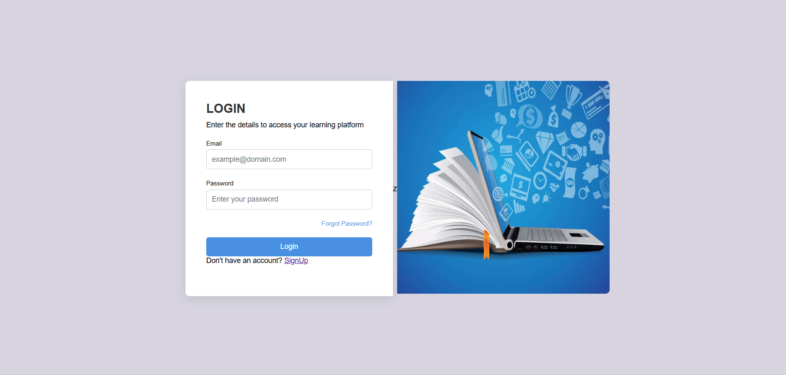
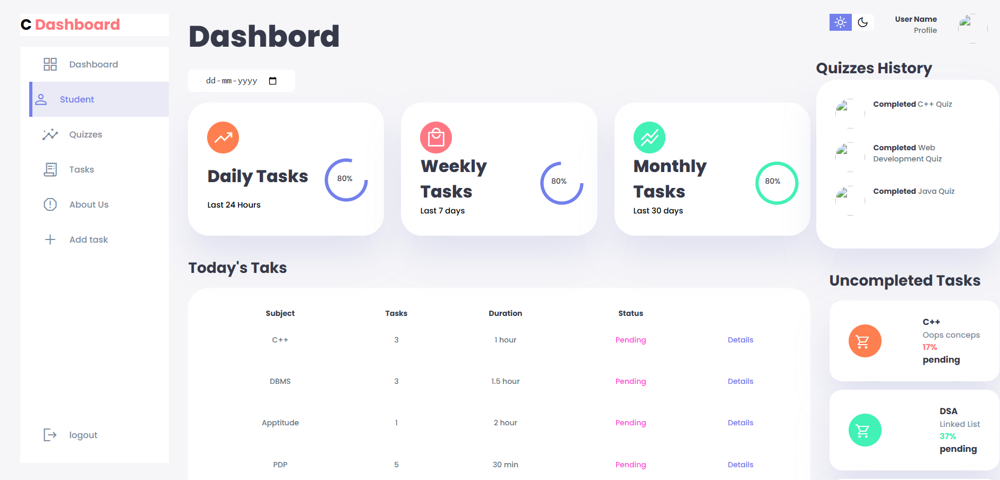
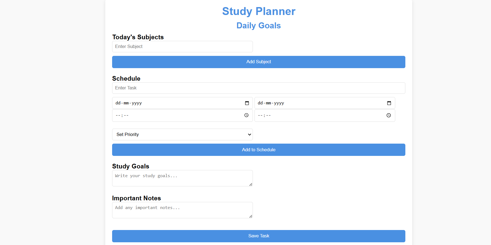
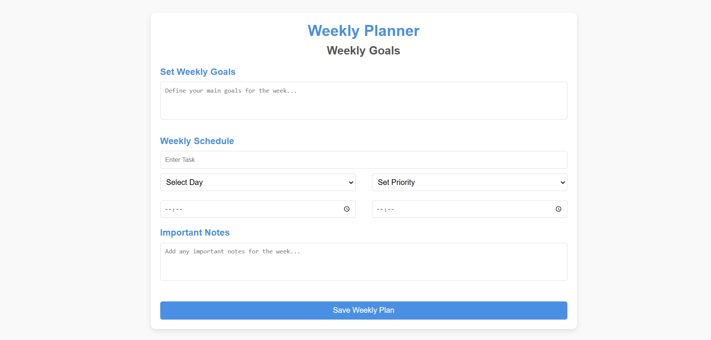
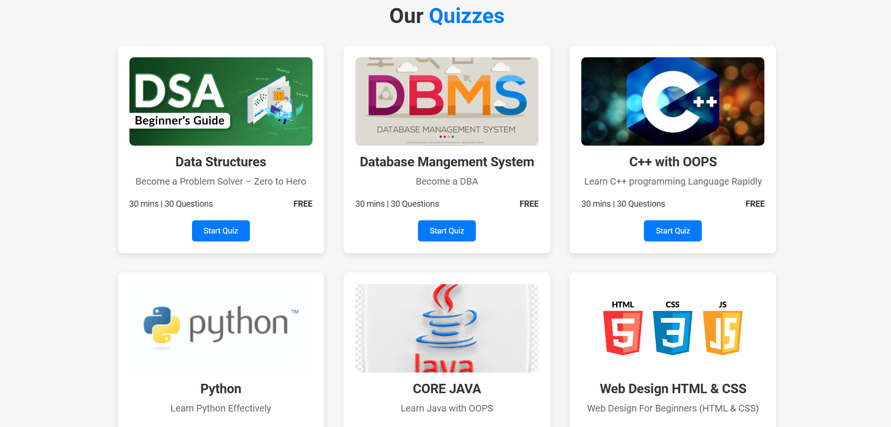

# 📚 Study Planner Website

A **Smart Education Platform** designed to make learning more effective and organized. This project includes task scheduling, quizzes, and analytics to help students stay on top of their studies.

---

## 📑 Table of Contents

1. [Features](#features)  
2. [Screenshots](#screenshots)  
3. [Tech Stack](#tech-stack)  
4. [Setup Instructions](#setup-instructions)  
5. [Contributors](#contributors)

---

## ✨ Features

- 📅 **Daily & Weekly Schedules**: Plan your tasks effectively with daily and weekly views.  
- 📝 **Quizzes**: Test your knowledge with interactive quizzes.  
- 🔔 **Reminders & Notifications**: Stay updated about deadlines.  
- 📊 **Dashboard Analytics**: Visualize your progress and stats.  
- 🎯 **Benefits Section**: Understand how this platform enhances your productivity.  

---

## 📸 Screenshots

### Home Page  
Welcome to the Study Planner!  

### Sign Up Page  
Create your account to get started.  

### Login Page  
Access your personalized study planner.  

### Dashboard  
An overview of your tasks and progress.  

### Daily Schedule  
Plan your day efficiently.  

### Weekly Schedule  
Organize your week for maximum productivity.  

### Quizzes Section  
Interactive quizzes to test your knowledge.  

### Benefits Section  
Explore how this platform helps you achieve your study goals.  

---

## 💻 Tech Stack

**Frontend**:  
  
  

**Backend**:  
  

---

Database Import Instructions
## 🛠️ Setup Instructions

1. Clone the repository:
   git clone https://github.com/harshit-verma-2005/study-planner.git
   
2. Import the database into MySQL:

Open phpMyAdmin.
Create a new database (e.g., study_planner_db).
Import the database.sql file located in the project root.

3. Start your local server (e.g., XAMPP or WAMP).

4. Open the project in your browser:
     ->  http://localhost/study-planner

🌟 Example Credentials (for testing)
Role	Username	Password
Admin	admin	admin123
User	testuser	test123

---

### **Contributors Section**
 🤝 Contributors

Thanks to all the contributors who made this project possible! 💖  

🚀 About the Developer
💡 Designed and developed by Harshit Verma.
If you like this project, don't forget to star ⭐ the repository!

Database File:
Make sure the database.sql file is present in the root directory of your project.

Test User Credentials:
Customize the example credentials table if needed to match your app's database.
